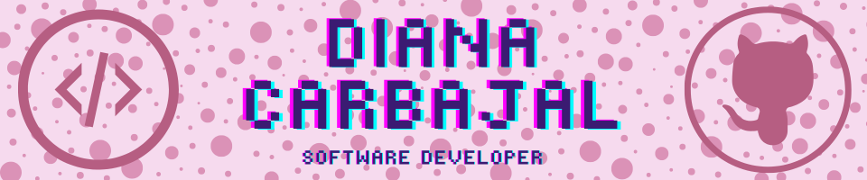

<!--
Gif cerdo tecleando: https://media1.giphy.com/media/v1.Y2lkPTc5MGI3NjExeWRyNWEzb2YwNjB6cnFpNjFlNDliZ3FqNzh3dDJ2aHFuNmdlYjFpdyZlcD12MV9pbnRlcm5hbF9naWZfYnlfaWQmY3Q9cw/1NYkJ0wTvncdXV5dN5/giphy.webp
-->
# 
<h1 align="center">Bienvenid@ al GitHub de Dian</h1>

## &nbsp;***Sobre mí*** &nbsp;
| ¡Hola! No soy un bot. Actualmente estoy en mi segundo año de formación en Desarrollo de Aplicaciones Multiplataforma (DAM). Estoy emocionada porque pronto tendré la oportunidad de poner en práctica mis conocimientos al ingresar a una empresa para realizar mis prácticas profesionales.

| Soy una apasionada por la tecnología y el desarrollo de software; disfruto mucho de lo que hago y estoy comprometida con aprender continuamente para crecer tanto personal como profesionalmente. Mi objetivo es adquirir habilidades y experiencias que me permitan afrontar retos, aportar valor a los proyectos en los que participe y construir una sólida carrera en el mundo del desarrollo de aplicaciones.

| Este GitHub es un espacio donde espero plasmar mi aprendizaje y creatividad a través de proyectos que reflejen mi evolución como desarrolladora. ¡Estoy ansiosa por llenarlo de ideas, soluciones y mucho código! 😊

| Si compartes la misma pasión por el desarrollo o simplemente quieres conocer más de mi trabajo, no dudes en explorar mis proyectos. ¡Hablemos y creemos algo increíble juntos! 🚀

## &nbsp;***Lenguajes y herramientas*** &nbsp;

## &nbsp;***Aprendiendo*** &nbsp;

## &nbsp;***Idiomas*** &nbsp;
- Chino
- Inglés

🚀 ¡Siempre aprendiendo y lista para nuevos desafíos!

